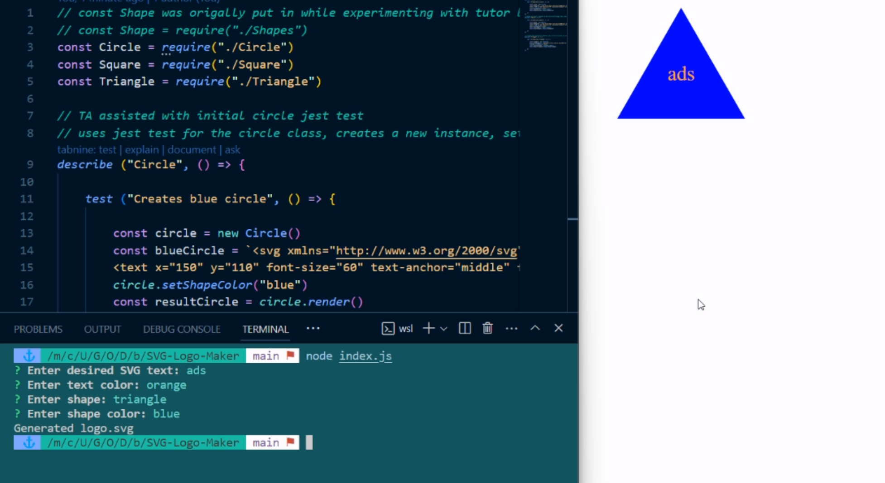

# SVG-Logo-Maker

## Description

When I am prompted for text
Then I can enter up to three characters
When I am prompted for the text color
Then I can enter a color keyword (OR a hexadecimal number)
When I am prompted for a shape
Then I am presented with a list of shapes to choose from: circle, triangle, and square
When I am prompted for the shape's color
Then I can enter a color keyword (OR a hexadecimal number)
When I have entered input for all the prompts
Then an SVG file is created named `logo.svg`
And the output text "Generated logo.svg" is printed in the command line
When I open the `logo.svg` file in a browser
Then I am shown a 300x200 pixel image that matches the criteria I entered

## Table of Contents

- [Installation](#installation)
- [Usage](#usage)
- [Credits](#credits)
- [License](#license)
- [Features](#features)
- [How to Contribute](#how-to-contribute)
- [Tests](#tests)

## Installation

N/A

## Usage

Here is a walkthrough video link: https://drive.google.com/file/d/12CzA0QxlrTfpjbZa1KHKc2jJq7Q1IEgY/view  

## Credits

Giselle Reyes, Professor Phil Lloyd, Tutor Juan Delgado, and TA Quentin Jones

## License

## Features

Website

## How to Contribute

Personal challenge

## Tests

Used VS Code, Jest